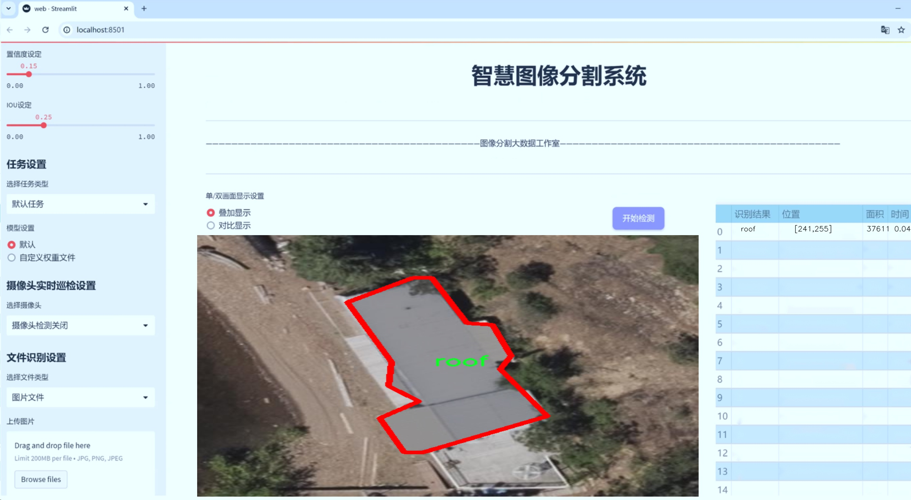
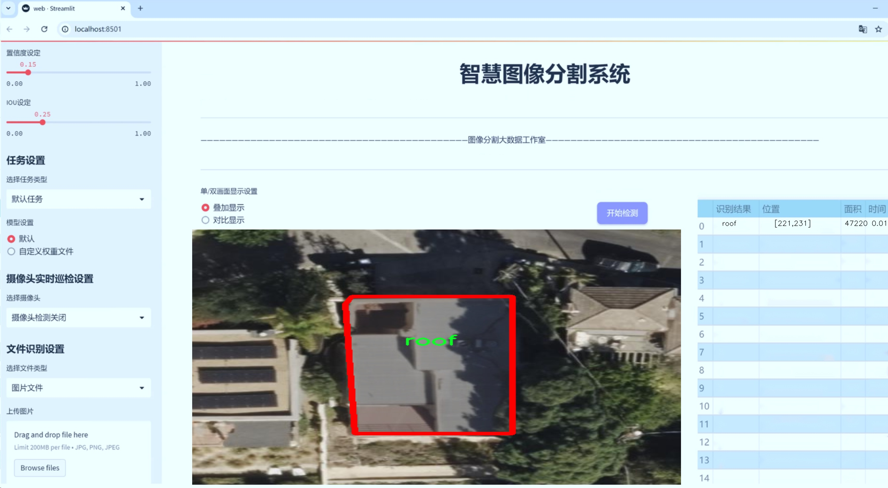
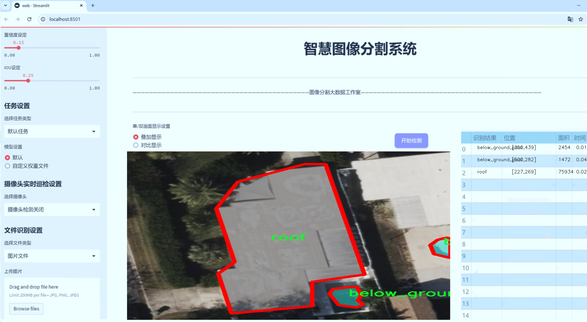
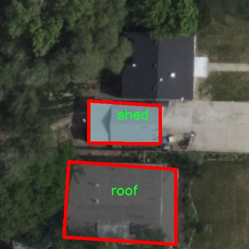
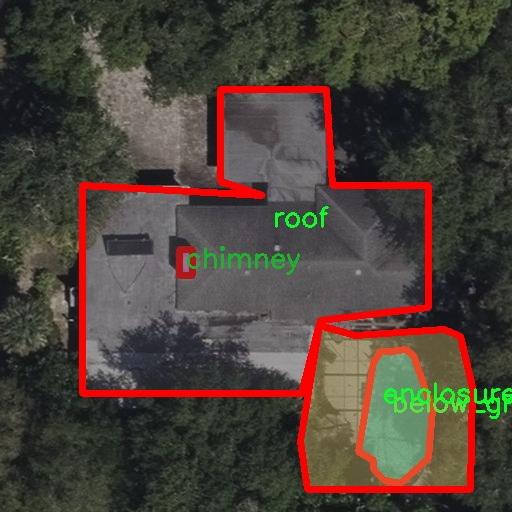
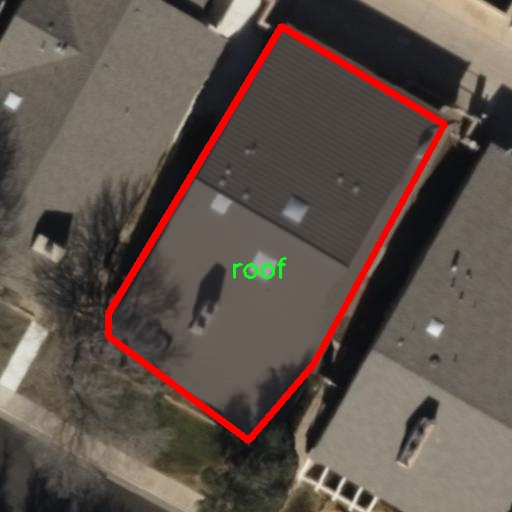
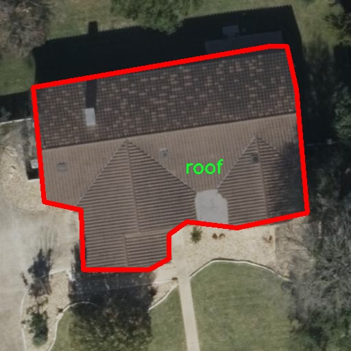
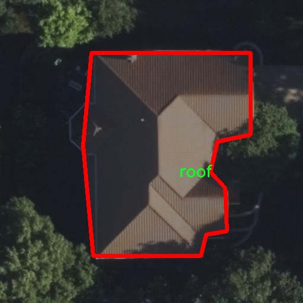

# 航拍图建筑物结构损伤识别图像分割系统源码＆数据集分享
 [yolov8-seg-C2f-ContextGuided＆yolov8-seg-rtdetr等50+全套改进创新点发刊_一键训练教程_Web前端展示]

### 1.研究背景与意义

项目参考[ILSVRC ImageNet Large Scale Visual Recognition Challenge](https://gitee.com/YOLOv8_YOLOv11_Segmentation_Studio/projects)

项目来源[AAAI Global Al lnnovation Contest](https://kdocs.cn/l/cszuIiCKVNis)

研究背景与意义

随着城市化进程的加快，建筑物的数量与复杂性不断增加，建筑物的结构安全性和耐久性日益受到关注。尤其是在自然灾害频发的地区，建筑物的损伤识别与评估显得尤为重要。传统的建筑物损伤检测方法多依赖人工检查，效率低下且容易受到主观因素的影响。近年来，随着无人机技术的迅速发展，航拍图像的获取变得更加便捷，结合计算机视觉技术，尤其是深度学习算法，能够实现对建筑物结构损伤的自动化识别与分析。

YOLO（You Only Look Once）系列算法作为目标检测领域的前沿技术，凭借其高效的实时检测能力和良好的准确性，广泛应用于各类图像识别任务。YOLOv8作为该系列的最新版本，进一步提升了模型的性能，尤其在实例分割任务中表现出色。通过对航拍图像进行处理，YOLOv8能够有效识别建筑物的各类损伤特征，如屋顶缺失、锈蚀、材料缺失等。这些特征的准确识别不仅有助于快速评估建筑物的安全性，还能为后续的维修和加固提供科学依据。

本研究旨在基于改进的YOLOv8模型，构建一个航拍图建筑物结构损伤识别的图像分割系统。该系统将利用1600幅航拍图像和14类建筑物损伤特征的数据集进行训练和测试，涵盖了从屋顶到围栏等多种结构元素的损伤类型。这一数据集的多样性和丰富性为模型的训练提供了良好的基础，使其能够在实际应用中具备较强的泛化能力。

通过对航拍图像的深度学习分析，研究不仅可以实现对建筑物损伤的自动化识别，还能够为建筑物的维护管理提供数据支持。随着建筑物损伤识别技术的不断成熟，未来可以在灾后评估、日常巡检等多个领域得到广泛应用，极大地提高工作效率，降低人工成本。此外，基于图像分割的损伤识别系统也为智能城市建设提供了技术支撑，推动了建筑物安全管理的智能化进程。

综上所述，本研究不仅具有重要的理论意义，也具备广泛的实际应用价值。通过改进YOLOv8模型，构建高效的航拍图建筑物结构损伤识别系统，将为建筑物的安全监测和维护提供新的解决方案，推动建筑行业的数字化转型与智能化发展。这一研究成果将为未来的城市安全管理提供有力的技术支持，助力实现更加安全、可持续的城市环境。

### 2.图片演示







##### 注意：由于此博客编辑较早，上面“2.图片演示”和“3.视频演示”展示的系统图片或者视频可能为老版本，新版本在老版本的基础上升级如下：（实际效果以升级的新版本为准）

  （1）适配了YOLOV8的“目标检测”模型和“实例分割”模型，通过加载相应的权重（.pt）文件即可自适应加载模型。

  （2）支持“图片识别”、“视频识别”、“摄像头实时识别”三种识别模式。

  （3）支持“图片识别”、“视频识别”、“摄像头实时识别”三种识别结果保存导出，解决手动导出（容易卡顿出现爆内存）存在的问题，识别完自动保存结果并导出到tempDir中。

  （4）支持Web前端系统中的标题、背景图等自定义修改，后面提供修改教程。

  另外本项目提供训练的数据集和训练教程,暂不提供权重文件（best.pt）,需要您按照教程进行训练后实现图片演示和Web前端界面演示的效果。

### 3.视频演示

[3.1 视频演示](https://www.bilibili.com/video/BV1GryWYuEmJ/)

### 4.数据集信息展示

##### 4.1 本项目数据集详细数据（类别数＆类别名）

nc: 14
names: ['above_ground_pool', 'ac_unit', 'below_ground_pool', 'chimney', 'enclosure', 'missing_material', 'roof', 'rust', 'shed', 'skylight', 'solar_panel', 'tarp', 'trampoline', 'wooden_deck']


##### 4.2 本项目数据集信息介绍

数据集信息展示

在本研究中，我们使用了名为“yolov8-key-test”的数据集，以训练和改进YOLOv8-seg模型，旨在实现对航拍图像中建筑物结构损伤的精准识别与图像分割。该数据集包含14个类别，涵盖了建筑物及其周边环境中可能出现的多种结构特征和损伤类型。这些类别的多样性不仅为模型提供了丰富的训练样本，也使得模型在实际应用中能够更好地适应不同的场景和条件。

具体而言，数据集中包含的类别包括：above_ground_pool（地面上游泳池）、ac_unit（空调机组）、below_ground_pool（地下游泳池）、chimney（烟囱）、enclosure（围栏）、missing_material（缺失材料）、roof（屋顶）、rust（锈蚀）、shed（小屋）、skylight（天窗）、solar_panel（太阳能电池板）、tarp（防水布）、trampoline（蹦床）以及wooden_deck（木质甲板）。这些类别的选择反映了在航拍图像中常见的建筑物及其附属结构的特征，涵盖了从基础设施到装饰性元素的广泛范围。

在数据集的构建过程中，研究团队注重了数据的多样性和代表性，确保每个类别都包含了足够的样本，以便模型能够学习到各类特征的细微差别。例如，地面上游泳池和地下游泳池的结构差异、烟囱的形状以及屋顶的材质等，都是影响建筑物整体健康状况的重要因素。通过对这些类别的细致划分，模型能够在识别过程中更准确地判断出潜在的损伤位置和类型。

此外，数据集的图像来源于多种不同的航拍条件，包括不同的天气、光照和拍摄角度，这为模型的鲁棒性提供了有力支持。航拍图像的多样性使得模型在训练过程中能够适应不同的环境变化，从而提高了其在实际应用中的表现。例如，在阴天和晴天拍摄的图像可能会对颜色和阴影产生不同的影响，模型需要能够有效地处理这些变化，以确保在各种条件下都能准确识别损伤。

在图像分割任务中，数据集中的每个类别都被精确标注，这为模型的训练提供了清晰的目标。通过使用像素级的标注，YOLOv8-seg模型能够在图像中精确定位每个结构的边界，进而实现高效的损伤检测和分类。这种精细化的标注方式，不仅提高了模型的准确性，也为后续的损伤评估和修复提供了重要依据。

综上所述，“yolov8-key-test”数据集为本研究提供了丰富的资源，涵盖了多种建筑物结构及其损伤类型，确保了模型训练的全面性和有效性。通过对这一数据集的深入分析和应用，我们期望能够显著提升航拍图像中建筑物结构损伤识别的准确性，为建筑物的维护和管理提供科学依据。











### 5.全套项目环境部署视频教程（零基础手把手教学）

[5.1 环境部署教程链接（零基础手把手教学）](https://www.bilibili.com/video/BV1jG4Ve4E9t/?vd_source=bc9aec86d164b67a7004b996143742dc)


[5.2 安装Python虚拟环境创建和依赖库安装视频教程链接（零基础手把手教学）](https://www.bilibili.com/video/BV1nA4VeYEze/?vd_source=bc9aec86d164b67a7004b996143742dc)

### 6.手把手YOLOV8-seg训练视频教程（零基础小白有手就能学会）

[6.1 手把手YOLOV8-seg训练视频教程（零基础小白有手就能学会）](https://www.bilibili.com/video/BV1cA4VeYETe/?vd_source=bc9aec86d164b67a7004b996143742dc)


按照上面的训练视频教程链接加载项目提供的数据集，运行train.py即可开始训练



     Epoch   gpu_mem       box       obj       cls    labels  img_size
     1/200     0G   0.01576   0.01955  0.007536        22      1280: 100%|██████████| 849/849 [14:42<00:00,  1.04s/it]
               Class     Images     Labels          P          R     mAP@.5 mAP@.5:.95: 100%|██████████| 213/213 [01:14<00:00,  2.87it/s]
                 all       3395      17314      0.994      0.957      0.0957      0.0843

     Epoch   gpu_mem       box       obj       cls    labels  img_size
     2/200     0G   0.01578   0.01923  0.007006        22      1280: 100%|██████████| 849/849 [14:44<00:00,  1.04s/it]
               Class     Images     Labels          P          R     mAP@.5 mAP@.5:.95: 100%|██████████| 213/213 [01:12<00:00,  2.95it/s]
                 all       3395      17314      0.996      0.956      0.0957      0.0845

     Epoch   gpu_mem       box       obj       cls    labels  img_size
     3/200     0G   0.01561    0.0191  0.006895        27      1280: 100%|██████████| 849/849 [10:56<00:00,  1.29it/s]
               Class     Images     Labels          P          R     mAP@.5 mAP@.5:.95: 100%|███████   | 187/213 [00:52<00:00,  4.04it/s]
                 all       3395      17314      0.996      0.957      0.0957      0.0845


### 7.50+种全套YOLOV8-seg创新点代码加载调参视频教程（一键加载写好的改进模型的配置文件）

[7.1 50+种全套YOLOV8-seg创新点代码加载调参视频教程（一键加载写好的改进模型的配置文件）](https://www.bilibili.com/video/BV1Hw4VePEXv/?vd_source=bc9aec86d164b67a7004b996143742dc)

### 8.YOLOV8-seg图像分割算法原理

原始YOLOv8-seg算法原理

YOLOv8-seg算法是由Ultralytics公司于2023年推出的最新版本YOLO系列算法，标志着目标检测和分割领域的一次重要进步。该算法不仅在目标检测方面表现出色，还在图像分割任务中展现了强大的能力。YOLOv8-seg的设计理念是将高效性与准确性相结合，使得用户能够在多种应用场景中实现实时目标检测与分割。其核心结构由Backbone、Neck和Head三个主要部分组成，各部分协同工作，以实现高效的特征提取和目标识别。

在YOLOv8-seg的Backbone部分，采用了一系列卷积和反卷积层，旨在从输入图像中提取丰富的特征信息。该部分使用了C2模块作为基本构成单元，C2模块通过残差连接和瓶颈结构的设计，有效地减小了网络的复杂度，同时提升了模型的性能。具体而言，Backbone由5个CBS模块、4个C2f模块和1个快速空间金字塔池化（SPPF）模块组成。CBS模块通过卷积层和激活函数的组合，能够有效提取低层次特征，而C2f模块则通过特征的深度分离和重组，进一步增强了特征的表达能力。SPPF模块的引入，旨在提高模型的计算速度，使得YOLOv8-seg在处理高分辨率图像时依然能够保持良好的实时性。

接下来是Neck部分，它的主要功能是进行多尺度特征融合。YOLOv8-seg采用了PAN-FPN（Path Aggregation Network - Feature Pyramid Network）结构，通过对来自Backbone不同阶段的特征图进行融合，增强了模型对不同尺度目标的捕捉能力。这种多尺度特征融合技术使得YOLOv8-seg在面对各种尺寸的目标时，能够更好地保持检测的准确性和鲁棒性。通过将高层特征与低层特征进行结合，Neck部分不仅提升了模型的整体性能，还使得分割任务的效果得到了显著改善。

最后，Head部分负责最终的目标检测和分类任务。YOLOv8-seg设有三个检测头，分别用于处理不同尺寸的信息。每个检测头内部包含了一系列卷积层和反卷积层，旨在生成高质量的检测结果。与传统的Anchor-based方法不同，YOLOv8-seg采用了Anchor-Free的检测方式，这种设计简化了模型的复杂性，同时提高了检测的灵活性。检测头的解耦结构使得模型能够更好地适应不同的目标形状和尺寸，从而提高了目标检测的准确性。

值得一提的是，YOLOv8-seg在损失函数的设计上也进行了创新，采用了CloU损失函数。这种损失函数不仅考虑了目标的分类损失，还引入了对分割精度的约束，确保了模型在进行目标检测的同时，能够有效地进行图像分割。这一设计使得YOLOv8-seg在实际应用中，能够在复杂场景下保持高效的性能，尤其是在需要同时进行目标检测和分割的任务中，展现了其独特的优势。

综上所述，YOLOv8-seg算法通过其独特的网络结构和创新的设计理念，成功地将目标检测与图像分割相结合，提供了一种高效、准确的解决方案。其Backbone、Neck和Head的紧密协作，使得该算法在多种应用场景中都能够表现出色，尤其是在实时性和准确性要求较高的任务中，YOLOv8-seg无疑是一个值得关注的选择。随着深度学习技术的不断发展，YOLOv8-seg将继续推动目标检测和分割领域的进步，为各类应用提供更为强大的技术支持。


### 9.系统功能展示（检测对象为举例，实际内容以本项目数据集为准）

图9.1.系统支持检测结果表格显示

  图9.2.系统支持置信度和IOU阈值手动调节

  图9.3.系统支持自定义加载权重文件best.pt(需要你通过步骤5中训练获得)

  图9.4.系统支持摄像头实时识别

  图9.5.系统支持图片识别

  图9.6.系统支持视频识别

  图9.7.系统支持识别结果文件自动保存

  图9.8.系统支持Excel导出检测结果数据


### 10.50+种全套YOLOV8-seg创新点原理讲解（非科班也可以轻松写刊发刊，V11版本正在科研待更新）

#### 10.1 由于篇幅限制，每个创新点的具体原理讲解就不一一展开，具体见下列网址中的创新点对应子项目的技术原理博客网址【Blog】：


[10.1 50+种全套YOLOV8-seg创新点原理讲解链接](https://gitee.com/qunmasj/good)

#### 10.2 部分改进模块原理讲解(完整的改进原理见上图和技术博客链接)【如果此小节的图加载失败可以通过CSDN或者Github搜索该博客的标题访问原始博客，原始博客图片显示正常】
### 可变性卷积DCN简介
卷积神经网络由于其构建模块中固定的几何结构，本质上受限于模型几何变换。为了提高卷积神经网络的转换建模能力，《Deformable Convolutional Networks》作者提出了两个模块：可变形卷积（deformable convolution）和可变形RoI池（deformable RoI pooling）。这两个模块均基于用额外的偏移来增加模块中的空间采样位置以及从目标任务中学习偏移的思想，而不需要额外的监督。

第一次证明了在深度神经网络中学习密集空间变换（dense spatial transformation）对于复杂的视觉任务是有效的

视觉识别中的一个关键挑战是如何适应对象比例、姿态、视点和零件变形中的几何变化或模型几何变换。一般有两种方法实现：
1）建立具有足够期望变化的训练数据集。这通常通过增加现有的数据样本来实现，例如通过仿射变换。但是训练成本昂贵而且模型参数庞大。
2）使用变换不变（transformation-invariant）的特征和算法。比如比较有名的SIFT(尺度不变特征变换)便是这一类的代表算法。

但以上的方法有两个缺点：
1）几何变换被假定为固定的和已知的，这些先验知识被用来扩充数据，设计特征和算法。为此，这个假设阻止了对具有未知几何变换的新任务的推广，从而导致这些几何变换可能没有被正确建模。
2）对于不变特征和算法进行手动设计，对于过于复杂的变换可能是困难的或不可行的。

卷积神经网络本质上局限于模拟大型未知转换。局限性源于CNN模块的固定几何结构：卷积单元在固定位置对输入特征图进行采样；池化层以固定比率降低特征矩阵分辨率；RoI（感兴趣区域）池化层将RoI分成固定的空间箱（spatial bins）等。缺乏处理几何变换的内部机制。

这种内部机制的缺乏会导致一些问题，举个例子。同一个CNN层中所有激活单元的感受野大小是相同的，但是这是不可取的。因为不同的位置可能对应于具有不同尺度或变形的对象，所以尺度或感受野大小的自适应确定对于具有精细定位的视觉识别是渴望的。

对于这些问题，作者提出了两个模块提高CNNs对几何变换建模的能力。


deformable convolution（可变形卷积）
将2D偏移量添加到标准卷积中的常规网格采样位置，使得采样网格能够自由变形。通过额外的卷积层，从前面的特征映射中学习偏移。因此，变形采用局部、密集和自适应的方式取决于输入特征。


deformable RoI pooling（可变形RoI池化）
为先前RoI池化的常规库（bin）分区中的每个库位置（bin partition）增加了一个偏移量。类似地，偏移是从前面的特征图和感兴趣区域中学习的，从而能够对具有不同形状的对象进行自适应部件定位（adaptive part localization）。

#### Deformable Convolutional Networks
Deformable Convolution
2D卷积由两个步骤组成：
1）在输入特征图x xx上使用规则网格R RR进行采样。
2）把这些采样点乘不同权重w ww后相加。

网格R定义感受野大小和扩张程度，比如内核大小为3x3，扩张程度为1的网格R可以表示为：
R = { ( − 1 , − 1 ) , ( − 1 , 0 ) , … , ( 0 , 1 ) , ( 1 , 1 ) } R = \{(-1,-1),(-1,0),\dots,(0,1),(1,1)\}
R={(−1,−1),(−1,0),…,(0,1),(1,1)}

​
 一般为小数，使用双线性插值进行处理。（把小数坐标分解到相邻的四个整数坐标点来计算结果）


具体操作如图所示：


首先对输入特征层进行一个普通的3x3卷积处理得到偏移域（offset field）。偏移域特征图具有与输入特征图相同的空间分辨率，channels维度2N对应于N个2D（xy两个方向）偏移。其中的N是原输入特征图上所具有的N个channels，也就是输入输出channels保持不变，这里xy两个channels分别对输出特征图上的一个channels进行偏移。确定采样点后就通过与相对应的权重w点乘相加得到输出特征图上该点最终值。

前面也提到过，由于这里xy两个方向所训练出来的偏移量一般来说是一个小数，那么为了得到这个点所对应的数值，会采用双线性插值的方法，从最近的四个邻近坐标点中计算得到该偏移点的数值，公式如下：


具体推理过程见：双线性插值原理

#### Deformable RoI Poolingb
所有基于区域提议（RPN）的对象检测方法都使用RoI池话处理，将任意大小的输入矩形区域转换为固定大小的特征图。


 一般为小数，需要使用双线性插值进行处理。


具体操作如图所示：


当时看这个部分的时候觉得有些突兀，明明RoI池化会将特征层转化为固定尺寸的区域。其实，我个人觉得，这个部分与上述的可变性卷积操作是类似的。这里同样是使用了一个普通的RoI池化操作，进行一些列处理后得到了一个偏移域特征图，然后重新作用于原来的w × H w \times Hw×H的RoI。只不过这里不再是规律的逐行逐列对每个格子进行池化，而是对于格子进行偏移后再池化处理。

#### Postion﹣Sensitive RoI Pooling
除此之外，论文还提出一种PS RoI池化（Postion﹣Sensitive RoI Pooling）。不同于上述可变形RoI池化中的全连接过程，这里使用全卷积替换。

具体操作如图所示：


首先，对于原来的特征图来说，原本是将输入特征图上的RoI区域分成k × k k\times kk×k个bin。而在这里，则是将输入特征图进行卷积操作，分别得到一个channels为k 2 ( C + 1 ) k^{2}(C+1)k (C+1)的得分图（score maps）和一个channels为2 k 2 ( C + 1 ) 2k{2}(C+1)2k 2 (C+1)的偏移域（offset fields），这两个特征矩阵的宽高是与输入特征矩阵相同的。其中，得分图的channels中，k × k k \times kk×k分别表示的是每一个网格，C CC表示的检测对象的类别数目，1表示背景。而在偏移域中的2表示xy两个方向的偏移。
也就是说，在PS RoI池化中，对于RoI的每一个网格都独自占一个通道形成一层得分图，然后其对于的偏移量占两个通道。offset fields得到的偏移是归一化后的偏移，需要通过和deformable RoI pooling中一样的变换方式得到∆ p i j ∆p_{ij}∆p ij，然后对每层得分图进行偏移池化处理。最后处理完的结果就对应着最后输出的一个网格。所以其包含了位置信息。

原文论述为：


#### Understanding Deformable ConvNets
当可变形卷积叠加时，复合变形的效果是深远的。如图所示：


ps：a是标准卷积的固定感受野，b是可变形卷积的适应性感受野。

感受野和标准卷积中的采样位置在整个顶部特征图上是固定的(左)。在可变形卷积中，它们根据对象的比例和形状进行自适应调整(右)。


### 11.项目核心源码讲解（再也不用担心看不懂代码逻辑）

#### 11.1 utils.py

以下是经过简化和注释的核心代码部分：

```python
import os
import cv2
import pandas as pd
import streamlit as st
from PIL import Image
from QtFusion.path import abs_path

def save_uploaded_file(uploaded_file):
    """
    保存上传的文件到服务器上。

    Args:
        uploaded_file (UploadedFile): 通过Streamlit上传的文件。

    Returns:
        str: 保存文件的完整路径，如果没有文件上传则返回 None。
    """
    if uploaded_file is not None:  # 检查是否有文件上传
        base_path = "tempDir"  # 定义文件保存的基本路径

        # 如果路径不存在，创建这个路径
        if not os.path.exists(base_path):
            os.makedirs(base_path)

        # 获取文件的完整路径
        file_path = os.path.join(base_path, uploaded_file.name)

        # 以二进制写模式打开文件并写入内容
        with open(file_path, "wb") as f:
            f.write(uploaded_file.getbuffer())  # 写入文件内容

        return file_path  # 返回文件路径

    return None  # 如果没有文件上传，返回 None


def concat_results(result, location, confidence, time):
    """
    显示检测结果。

    Args:
        result (str): 检测结果。
        location (str): 检测位置。
        confidence (str): 置信度。
        time (str): 检测用时。

    Returns:
        DataFrame: 包含检测结果的 DataFrame。
    """
    # 创建一个包含检测信息的 DataFrame
    result_data = {
        "识别结果": [result],
        "位置": [location],
        "置信度": [confidence],
        "用时": [time]
    }

    results_df = pd.DataFrame(result_data)  # 将字典转换为 DataFrame
    return results_df  # 返回结果 DataFrame


def get_camera_names():
    """
    获取可用摄像头名称列表。

    Returns:
        list: 返回包含“未启用摄像头”和可用摄像头索引号的列表。
    """
    camera_names = ["摄像头检测关闭", "0"]  # 初始化摄像头名称列表
    max_test_cameras = 10  # 定义要测试的最大摄像头数量

    # 测试可用摄像头
    for i in range(max_test_cameras):
        cap = cv2.VideoCapture(i, cv2.CAP_DSHOW)  # 尝试打开摄像头
        if cap.isOpened():  # 如果摄像头成功打开
            camera_names.append(str(i))  # 添加摄像头索引到列表
            cap.release()  # 释放摄像头资源

    if len(camera_names) == 1:  # 如果没有找到可用摄像头
        st.write("未找到可用的摄像头")  # 提示信息

    return camera_names  # 返回摄像头名称列表
```

### 代码核心部分说明：
1. **保存上传文件** (`save_uploaded_file`): 该函数用于将用户通过Streamlit上传的文件保存到服务器的指定目录中。如果没有文件上传，则返回`None`。

2. **显示检测结果** (`concat_results`): 该函数将检测结果、位置、置信度和用时等信息整理成一个`DataFrame`，便于后续处理和展示。

3. **获取摄像头名称** (`get_camera_names`): 该函数用于检测系统中可用的摄像头，并返回一个包含摄像头索引的列表。如果没有找到可用的摄像头，会给出提示。

这个 `utils.py` 文件包含了一些实用的函数，主要用于处理文件上传、显示检测结果、加载默认图片以及获取可用摄像头的名称。

首先，`save_uploaded_file` 函数用于保存用户通过 Streamlit 上传的文件。它首先检查是否有文件被上传，如果有，则定义一个基本的保存路径 `tempDir`。如果该路径不存在，函数会创建这个目录。接着，函数会构建文件的完整路径，并以二进制写入模式打开文件，将上传的内容写入到指定路径中。最后，函数返回保存文件的完整路径，如果没有文件上传，则返回 `None`。

接下来，`concat_results` 函数用于显示检测结果。它接收四个参数：检测结果、检测位置、置信度和检测用时。函数将这些信息组织成一个字典，然后使用 Pandas 创建一个 DataFrame，以便于后续的数据处理和展示。

`load_default_image` 函数用于加载一个默认的图片。它通过调用 `abs_path` 函数获取默认图片的绝对路径，并使用 PIL 库打开该图片，最后返回图片对象。

最后，`get_camera_names` 函数用于获取可用摄像头的名称列表。它初始化一个包含“摄像头检测关闭”和索引“0”的列表，并定义一个最大测试摄像头数量的限制。函数通过循环尝试打开不同索引的摄像头，如果成功打开，则将该索引添加到摄像头名称列表中。若未找到可用的摄像头，函数会在 Streamlit 界面上输出相应的提示信息。最终，函数返回可用摄像头的名称列表。

整体来看，这个文件提供了一些基础的工具函数，方便在 Streamlit 应用中处理文件和摄像头相关的操作。

#### 11.2 ultralytics\nn\extra_modules\orepa.py

以下是提取并注释后的核心代码部分，主要是 `OREPA` 类的实现。该类实现了一种新的卷积结构，结合了多个分支的卷积操作。

```python
import torch
import torch.nn as nn
import torch.nn.init as init
import torch.nn.functional as F
import numpy as np

# 定义 OREPA 类，继承自 nn.Module
class OREPA(nn.Module):
    def __init__(self, in_channels, out_channels, kernel_size=3, stride=1, padding=None, groups=1, dilation=1, act=True):
        super(OREPA, self).__init__()
        
        # 激活函数的选择
        self.nonlinear = nn.ReLU() if act else nn.Identity()
        
        # 保存输入输出通道数、卷积核大小等参数
        self.in_channels = in_channels
        self.out_channels = out_channels
        self.kernel_size = kernel_size
        self.stride = stride
        self.groups = groups
        self.dilation = dilation
        
        # 初始化卷积核
        self.weight_orepa_origin = nn.Parameter(torch.Tensor(out_channels, in_channels // groups, kernel_size, kernel_size))
        init.kaiming_uniform_(self.weight_orepa_origin, a=math.sqrt(0.0))  # 使用 Kaiming 初始化
        
        # 其他卷积分支的权重初始化
        self.weight_orepa_avg_conv = nn.Parameter(torch.Tensor(out_channels, in_channels // groups, 1, 1))
        init.kaiming_uniform_(self.weight_orepa_avg_conv, a=0.0)
        
        self.weight_orepa_1x1 = nn.Parameter(torch.Tensor(out_channels, in_channels // groups, 1, 1))
        init.kaiming_uniform_(self.weight_orepa_1x1, a=0.0)
        
        # 其他分支的权重
        self.vector = nn.Parameter(torch.Tensor(3, out_channels))  # 用于加权不同分支的输出
        
        # 初始化权重向量
        init.constant_(self.vector[0, :], 1.0)  # origin
        init.constant_(self.vector[1, :], 0.5)  # avg
        init.constant_(self.vector[2, :], 0.5)  # 1x1

    def weight_gen(self):
        # 生成最终的卷积权重
        weight_orepa_origin = self.weight_orepa_origin * self.vector[0, :].view(-1, 1, 1, 1)
        weight_orepa_avg = self.weight_orepa_avg_conv * self.vector[1, :].view(-1, 1, 1, 1)
        weight_orepa_1x1 = self.weight_orepa_1x1 * self.vector[2, :].view(-1, 1, 1, 1)
        
        # 将所有分支的权重相加
        weight = weight_orepa_origin + weight_orepa_avg + weight_orepa_1x1
        return weight

    def forward(self, inputs):
        # 前向传播
        weight = self.weight_gen()  # 生成权重
        out = F.conv2d(inputs, weight, stride=self.stride, padding=self.kernel_size // 2, dilation=self.dilation, groups=self.groups)
        return self.nonlinear(out)  # 应用激活函数

# 示例使用
# model = OREPA(in_channels=3, out_channels=16)
# output = model(torch.randn(1, 3, 224, 224))  # 输入一个随机张量
```

### 代码注释说明：
1. **类的初始化**：`__init__` 方法中定义了卷积层的输入输出通道、卷积核大小、步幅、填充、分组数和扩张率等参数。还初始化了多个卷积分支的权重。
2. **权重生成**：`weight_gen` 方法用于生成最终的卷积权重，结合了不同分支的权重并通过向量加权。
3. **前向传播**：`forward` 方法实现了前向传播过程，调用 `weight_gen` 生成权重，并通过 `F.conv2d` 进行卷积操作，最后应用激活函数。

这个结构的设计使得模型能够灵活地组合不同的卷积操作，从而提高特征提取的能力。

这个程序文件 `orepa.py` 是一个用于构建和操作深度学习模型的 PyTorch 模块，主要实现了一种名为 OREPA（Optimized Reparameterization for Efficient Convolutional Neural Networks）的卷积层。文件中包含多个类和函数，下面是对其主要内容的说明。

首先，文件导入了必要的库，包括 PyTorch 和 NumPy，并定义了一些辅助函数。`transI_fusebn` 函数用于将卷积层的权重与批归一化层的参数融合，以便在推理时减少计算量。`transVI_multiscale` 函数则用于对卷积核进行多尺度填充。

接下来，`OREPA` 类是核心类之一，继承自 `nn.Module`。它的构造函数接收多个参数，如输入通道数、输出通道数、卷积核大小、步幅、填充、分组数等。根据 `deploy` 参数的值，类会选择不同的初始化方式。如果 `deploy` 为真，则创建一个标准的卷积层；否则，初始化多个卷积权重参数，并设置它们的初始值。

`OREPA` 类中还定义了 `fre_init` 和 `weight_gen` 方法。`fre_init` 方法用于初始化一些特定的权重，`weight_gen` 方法则生成最终的卷积权重，结合了不同的卷积分支的权重。

`forward` 方法是模型的前向传播函数，根据输入数据计算输出。如果处于部署模式，则直接使用预先定义的卷积层；否则，生成权重并进行卷积操作。

`OREPA_LargeConv` 类实现了一个大型卷积模块，允许使用更大的卷积核。它的构造函数和 `forward` 方法与 `OREPA` 类类似，但包含了更多的卷积层和权重生成逻辑。

`ConvBN` 类是一个简单的卷积层加批归一化层的组合，提供了在训练和推理时的不同处理方式。

`OREPA_3x3_RepVGG` 类是针对 3x3 卷积核的 OREPA 实现，提供了更细粒度的控制和初始化。

最后，`RepVGGBlock_OREPA` 类是一个复合模块，结合了多个卷积分支和批归一化，支持可选的 Squeeze-and-Excitation (SE) 注意力机制。它的 `forward` 方法将输入数据通过不同的卷积路径进行处理，并将结果相加。

整体而言，这个文件实现了一个灵活且高效的卷积层结构，适用于深度学习模型的构建，特别是在需要优化计算效率和内存使用的场景中。

#### 11.3 ui.py

以下是代码中最核心的部分，并附上详细的中文注释：

```python
import sys
import subprocess

def run_script(script_path):
    """
    使用当前 Python 环境运行指定的脚本。

    Args:
        script_path (str): 要运行的脚本路径

    Returns:
        None
    """
    # 获取当前 Python 解释器的路径
    python_path = sys.executable

    # 构建运行命令，使用 streamlit 运行指定的脚本
    command = f'"{python_path}" -m streamlit run "{script_path}"'

    # 执行命令
    result = subprocess.run(command, shell=True)
    # 检查命令执行的返回码，如果不为0则表示出错
    if result.returncode != 0:
        print("脚本运行出错。")


# 实例化并运行应用
if __name__ == "__main__":
    # 指定要运行的脚本路径
    script_path = "web.py"  # 这里可以直接指定脚本名

    # 调用函数运行脚本
    run_script(script_path)
```

### 代码注释说明：
1. **导入模块**：
   - `sys`：用于访问与 Python 解释器紧密相关的变量和函数。
   - `subprocess`：用于执行外部命令和与其交互。

2. **定义 `run_script` 函数**：
   - 该函数接受一个参数 `script_path`，表示要运行的 Python 脚本的路径。
   - 使用 `sys.executable` 获取当前 Python 解释器的路径，以确保在正确的环境中运行脚本。
   - 构建一个命令字符串，使用 `streamlit` 模块运行指定的脚本。
   - 使用 `subprocess.run` 执行构建的命令，并通过 `shell=True` 允许在 shell 中执行命令。
   - 检查命令的返回码，如果返回码不为0，表示脚本运行出错，打印错误信息。

3. **主程序入口**：
   - 使用 `if __name__ == "__main__":` 确保只有在直接运行该脚本时才会执行以下代码。
   - 指定要运行的脚本路径（在这里是 `web.py`）。
   - 调用 `run_script` 函数来执行指定的脚本。

这个程序文件名为 `ui.py`，主要功能是通过当前的 Python 环境来运行一个指定的脚本，具体是一个名为 `web.py` 的文件。程序首先导入了必要的模块，包括 `sys`、`os` 和 `subprocess`，以及一个自定义的路径处理函数 `abs_path`。

在 `run_script` 函数中，首先获取当前 Python 解释器的路径，这通过 `sys.executable` 实现。接着，构建一个命令字符串，用于调用 `streamlit` 运行指定的脚本。这个命令字符串的格式是 `"{python_path}" -m streamlit run "{script_path}"`，其中 `python_path` 是当前 Python 解释器的路径，`script_path` 是要运行的脚本的路径。

然后，使用 `subprocess.run` 方法执行这个命令，`shell=True` 参数表示在 shell 中执行命令。执行后，程序会检查返回的状态码，如果状态码不为零，表示脚本运行出错，此时会打印出错误信息。

在文件的最后部分，使用 `if __name__ == "__main__":` 来确保当该文件作为主程序运行时，才会执行以下代码。这里指定了要运行的脚本路径，即通过 `abs_path` 函数获取的 `web.py` 的绝对路径，并调用 `run_script` 函数来执行这个脚本。

总体来说，这个程序的目的是提供一个简单的接口，通过命令行运行一个指定的 Python 脚本，并处理可能出现的错误。

#### 11.4 ultralytics\utils\callbacks\hub.py

以下是经过简化并添加详细中文注释的核心代码部分：

```python
import json
from time import time
from ultralytics.hub.utils import HUB_WEB_ROOT, PREFIX, events
from ultralytics.utils import LOGGER, SETTINGS

def on_fit_epoch_end(trainer):
    """在每个训练周期结束时上传训练进度指标。"""
    session = getattr(trainer, 'hub_session', None)  # 获取训练器的会话对象
    if session:
        # 获取当前训练损失和指标
        all_plots = {**trainer.label_loss_items(trainer.tloss, prefix='train'), **trainer.metrics}
        # 如果是第一个周期，添加模型信息
        if trainer.epoch == 0:
            from ultralytics.utils.torch_utils import model_info_for_loggers
            all_plots = {**all_plots, **model_info_for_loggers(trainer)}
        
        # 将当前周期的指标添加到会话的指标队列中
        session.metrics_queue[trainer.epoch] = json.dumps(all_plots)
        
        # 检查是否超过上传指标的时间限制
        if time() - session.timers['metrics'] > session.rate_limits['metrics']:
            session.upload_metrics()  # 上传指标
            session.timers['metrics'] = time()  # 重置计时器
            session.metrics_queue = {}  # 重置指标队列

def on_model_save(trainer):
    """在模型保存时上传检查点，带有速率限制。"""
    session = getattr(trainer, 'hub_session', None)  # 获取训练器的会话对象
    if session:
        is_best = trainer.best_fitness == trainer.fitness  # 判断当前模型是否是最佳模型
        # 检查是否超过上传检查点的时间限制
        if time() - session.timers['ckpt'] > session.rate_limits['ckpt']:
            LOGGER.info(f'{PREFIX}正在上传检查点 {HUB_WEB_ROOT}/models/{session.model_id}')
            session.upload_model(trainer.epoch, trainer.last, is_best)  # 上传模型
            session.timers['ckpt'] = time()  # 重置计时器

def on_train_end(trainer):
    """在训练结束时上传最终模型和指标到Ultralytics HUB。"""
    session = getattr(trainer, 'hub_session', None)  # 获取训练器的会话对象
    if session:
        LOGGER.info(f'{PREFIX}正在同步最终模型...')
        # 上传最终模型和指标
        session.upload_model(trainer.epoch, trainer.best, map=trainer.metrics.get('metrics/mAP50-95(B)', 0), final=True)
        session.alive = False  # 停止心跳
        LOGGER.info(f'{PREFIX}完成 ✅\n'
                    f'{PREFIX}查看模型在 {HUB_WEB_ROOT}/models/{session.model_id} 🚀')

# 根据设置决定是否启用回调函数
callbacks = {
    'on_fit_epoch_end': on_fit_epoch_end,
    'on_model_save': on_model_save,
    'on_train_end': on_train_end
} if SETTINGS['hub'] is True else {}  # 验证是否启用
```

### 代码核心部分说明：
1. **on_fit_epoch_end**: 该函数在每个训练周期结束时被调用，用于上传当前训练进度的指标，包括损失和其他评估指标。它还会在第一个周期时添加模型信息。通过检查时间限制来控制上传频率。

2. **on_model_save**: 该函数在模型保存时被调用，负责上传模型的检查点，并且有速率限制以防止过于频繁的上传。

3. **on_train_end**: 该函数在训练结束时被调用，负责上传最终的模型和训练指标，并停止与Ultralytics HUB的连接。

4. **callbacks**: 这是一个字典，存储了各个回调函数的映射关系，只有在设置中启用hub时才会被填充。

这个程序文件是Ultralytics YOLO项目中的一个回调函数模块，主要用于在训练、验证和预测过程中与Ultralytics HUB进行交互。文件中定义了一系列的回调函数，这些函数在特定事件发生时被调用，以便记录训练进度、上传模型和指标等。

首先，文件导入了一些必要的库和模块，包括`json`和`time`，以及Ultralytics HUB的相关工具和日志记录功能。接着，定义了一些回调函数：

1. **on_pretrain_routine_end**：在预训练例程结束时调用，主要用于记录信息并启动上传速率限制的计时器。如果训练器有与HUB的会话，则会记录模型的访问链接，并初始化计时器。

2. **on_fit_epoch_end**：在每个训练周期结束时调用，负责上传训练进度的指标。它会将当前的损失和指标合并成一个字典，并在达到速率限制时上传这些指标，同时重置计时器和指标队列。

3. **on_model_save**：在保存模型时调用，负责将检查点上传到Ultralytics HUB。它会检查是否是最佳模型，并在达到速率限制时上传模型，同时重置计时器。

4. **on_train_end**：在训练结束时调用，上传最终的模型和指标到Ultralytics HUB。它会记录上传的过程，并在完成后停止心跳信号。

5. **on_train_start**、**on_val_start**、**on_predict_start**、**on_export_start**：这些函数在训练、验证、预测和导出开始时调用，主要用于执行与事件相关的操作。

最后，文件定义了一个`callbacks`字典，包含了所有的回调函数，只有在设置中启用HUB时才会创建这个字典。这使得程序在需要与HUB交互时能够方便地调用相应的回调函数。整体来看，这个模块的设计使得训练过程中的数据上传和模型管理变得更加高效和系统化。

#### 11.5 ultralytics\utils\tal.py

以下是经过简化和注释的核心代码部分，主要包括 `TaskAlignedAssigner` 类及其相关方法。代码中保留了最重要的功能，并添加了详细的中文注释。

```python
import torch
import torch.nn as nn

def select_highest_overlaps(mask_pos, overlaps, n_max_boxes):
    """
    选择与多个目标框（gt）重叠的锚框中重叠度最高的一个。

    Args:
        mask_pos (Tensor): 形状为(b, n_max_boxes, h*w)的张量，表示每个锚框是否与目标框匹配。
        overlaps (Tensor): 形状为(b, n_max_boxes, h*w)的张量，表示每个锚框与目标框的重叠度。

    Returns:
        target_gt_idx (Tensor): 形状为(b, h*w)的张量，表示每个锚框对应的目标框索引。
        fg_mask (Tensor): 形状为(b, h*w)的张量，表示前景锚框的掩码。
        mask_pos (Tensor): 形状为(b, n_max_boxes, h*w)的张量，表示更新后的锚框匹配情况。
    """
    fg_mask = mask_pos.sum(-2)  # 计算每个锚框的前景掩码
    if fg_mask.max() > 1:  # 如果一个锚框被分配给多个目标框
        mask_multi_gts = (fg_mask.unsqueeze(1) > 1).expand(-1, n_max_boxes, -1)  # 生成多目标框掩码
        max_overlaps_idx = overlaps.argmax(1)  # 找到每个锚框重叠度最高的目标框索引

        is_max_overlaps = torch.zeros(mask_pos.shape, dtype=mask_pos.dtype, device=mask_pos.device)
        is_max_overlaps.scatter_(1, max_overlaps_idx.unsqueeze(1), 1)  # 标记重叠度最高的目标框

        mask_pos = torch.where(mask_multi_gts, is_max_overlaps, mask_pos).float()  # 更新掩码
        fg_mask = mask_pos.sum(-2)  # 重新计算前景掩码
    target_gt_idx = mask_pos.argmax(-2)  # 找到每个锚框对应的目标框索引
    return target_gt_idx, fg_mask, mask_pos


class TaskAlignedAssigner(nn.Module):
    """
    用于目标检测的任务对齐分配器。

    该类根据任务对齐度量将真实目标（gt）分配给锚框，结合了分类和定位信息。

    Attributes:
        topk (int): 考虑的前k个候选框数量。
        num_classes (int): 目标类别数量。
        alpha (float): 分类组件的alpha参数。
        beta (float): 定位组件的beta参数。
        eps (float): 防止除以零的小值。
    """

    def __init__(self, topk=13, num_classes=80, alpha=1.0, beta=6.0, eps=1e-9):
        """初始化TaskAlignedAssigner对象，设置超参数。"""
        super().__init__()
        self.topk = topk
        self.num_classes = num_classes
        self.bg_idx = num_classes  # 背景类别索引
        self.alpha = alpha
        self.beta = beta
        self.eps = eps

    @torch.no_grad()
    def forward(self, pd_scores, pd_bboxes, anc_points, gt_labels, gt_bboxes, mask_gt):
        """
        计算任务对齐分配。

        Args:
            pd_scores (Tensor): 形状为(bs, num_total_anchors, num_classes)的张量，表示每个锚框的预测得分。
            pd_bboxes (Tensor): 形状为(bs, num_total_anchors, 4)的张量，表示每个锚框的预测边界框。
            anc_points (Tensor): 形状为(num_total_anchors, 2)的张量，表示锚框的中心点。
            gt_labels (Tensor): 形状为(bs, n_max_boxes, 1)的张量，表示真实目标的标签。
            gt_bboxes (Tensor): 形状为(bs, n_max_boxes, 4)的张量，表示真实目标的边界框。
            mask_gt (Tensor): 形状为(bs, n_max_boxes, 1)的张量，表示真实目标的掩码。

        Returns:
            target_labels (Tensor): 形状为(bs, num_total_anchors)的张量，表示目标锚框的标签。
            target_bboxes (Tensor): 形状为(bs, num_total_anchors, 4)的张量，表示目标锚框的边界框。
            target_scores (Tensor): 形状为(bs, num_total_anchors, num_classes)的张量，表示目标锚框的得分。
            fg_mask (Tensor): 形状为(bs, num_total_anchors)的张量，表示前景锚框的掩码。
            target_gt_idx (Tensor): 形状为(bs, num_total_anchors)的张量，表示目标锚框对应的真实目标索引。
        """
        self.bs = pd_scores.size(0)  # 批次大小
        self.n_max_boxes = gt_bboxes.size(1)  # 最大目标框数量

        if self.n_max_boxes == 0:  # 如果没有真实目标框
            device = gt_bboxes.device
            return (torch.full_like(pd_scores[..., 0], self.bg_idx).to(device), 
                    torch.zeros_like(pd_bboxes).to(device),
                    torch.zeros_like(pd_scores).to(device), 
                    torch.zeros_like(pd_scores[..., 0]).to(device),
                    torch.zeros_like(pd_scores[..., 0]).to(device))

        # 获取正样本掩码和对齐度量
        mask_pos, align_metric, overlaps = self.get_pos_mask(pd_scores, pd_bboxes, gt_labels, gt_bboxes, anc_points, mask_gt)

        # 选择重叠度最高的目标框
        target_gt_idx, fg_mask, mask_pos = select_highest_overlaps(mask_pos, overlaps, self.n_max_boxes)

        # 获取目标标签、边界框和得分
        target_labels, target_bboxes, target_scores = self.get_targets(gt_labels, gt_bboxes, target_gt_idx, fg_mask)

        # 归一化对齐度量
        align_metric *= mask_pos
        pos_align_metrics = align_metric.amax(dim=-1, keepdim=True)  # 正样本对齐度量
        pos_overlaps = (overlaps * mask_pos).amax(dim=-1, keepdim=True)  # 正样本重叠度
        norm_align_metric = (align_metric * pos_overlaps / (pos_align_metrics + self.eps)).amax(-2).unsqueeze(-1)
        target_scores = target_scores * norm_align_metric  # 更新目标得分

        return target_labels, target_bboxes, target_scores, fg_mask.bool(), target_gt_idx

    def get_pos_mask(self, pd_scores, pd_bboxes, gt_labels, gt_bboxes, anc_points, mask_gt):
        """获取正样本掩码。"""
        mask_in_gts = select_candidates_in_gts(anc_points, gt_bboxes)  # 选择在真实目标框内的锚框
        align_metric, overlaps = self.get_box_metrics(pd_scores, pd_bboxes, gt_labels, gt_bboxes, mask_in_gts * mask_gt)  # 计算对齐度量和重叠度
        mask_topk = self.select_topk_candidates(align_metric, topk_mask=mask_gt.expand(-1, -1, self.topk).bool())  # 选择前k个候选框
        mask_pos = mask_topk * mask_in_gts * mask_gt  # 合并掩码

        return mask_pos, align_metric, overlaps

    def get_box_metrics(self, pd_scores, pd_bboxes, gt_labels, gt_bboxes, mask_gt):
        """计算预测框与真实框的对齐度量。"""
        na = pd_bboxes.shape[-2]  # 锚框数量
        mask_gt = mask_gt.bool()  # 转换为布尔类型掩码
        overlaps = torch.zeros([self.bs, self.n_max_boxes, na], dtype=pd_bboxes.dtype, device=pd_bboxes.device)  # 初始化重叠度张量
        bbox_scores = torch.zeros([self.bs, self.n_max_boxes, na], dtype=pd_scores.dtype, device=pd_scores.device)  # 初始化边界框得分张量

        ind = torch.zeros([2, self.bs, self.n_max_boxes], dtype=torch.long)  # 2, b, max_num_obj
        ind[0] = torch.arange(end=self.bs).view(-1, 1).expand(-1, self.n_max_boxes)  # b, max_num_obj
        ind[1] = gt_labels.squeeze(-1)  # b, max_num_obj
        bbox_scores[mask_gt] = pd_scores[ind[0], :, ind[1]][mask_gt]  # 获取每个锚框的得分

        # 计算重叠度
        pd_boxes = pd_bboxes.unsqueeze(1).expand(-1, self.n_max_boxes, -1, -1)[mask_gt]
        gt_boxes = gt_bboxes.unsqueeze(2).expand(-1, -1, na, -1)[mask_gt]
        overlaps[mask_gt] = bbox_iou(gt_boxes, pd_boxes, xywh=False, CIoU=True).squeeze(-1).clamp_(0)  # 计算IoU

        align_metric = bbox_scores.pow(self.alpha) * overlaps.pow(self.beta)  # 计算对齐度量
        return align_metric, overlaps

    def select_topk_candidates(self, metrics, largest=True, topk_mask=None):
        """
        根据给定的度量选择前k个候选框。

        Args:
            metrics (Tensor): 形状为(b, max_num_obj, h*w)的张量，表示每个锚框的度量。
            largest (bool): 如果为True，选择最大的值；否则选择最小的值。
            topk_mask (Tensor): 可选的布尔张量，形状为(b, max_num_obj, topk)。

        Returns:
            (Tensor): 形状为(b, max_num_obj, h*w)的张量，包含选择的前k个候选框。
        """
        topk_metrics, topk_idxs = torch.topk(metrics, self.topk, dim=-1, largest=largest)  # 获取前k个度量和索引
        if topk_mask is None:
            topk_mask = (topk_metrics.max(-1, keepdim=True)[0] > self.eps).expand_as(topk_idxs)  # 生成掩码

        topk_idxs.masked_fill_(~topk_mask, 0)  # 填充无效索引

        count_tensor = torch.zeros(metrics.shape, dtype=torch.int8, device=topk_idxs.device)  # 初始化计数张量
        ones = torch.ones_like(topk_idxs[:, :, :1], dtype=torch.int8, device=topk_idxs.device)
        for k in range(self.topk):
            count_tensor.scatter_add_(-1, topk_idxs[:, :, k:k + 1], ones)  # 更新计数张量

        count_tensor.masked_fill_(count_tensor > 1, 0)  # 过滤无效框
        return count_tensor.to(metrics.dtype)

    def get_targets(self, gt_labels, gt_bboxes, target_gt_idx, fg_mask):
        """
        计算正样本锚框的目标标签、边界框和得分。

        Args:
            gt_labels (Tensor): 真实目标标签，形状为(b, max_num_obj, 1)。
            gt_bboxes (Tensor): 真实目标边界框，形状为(b, max_num_obj, 4)。
            target_gt_idx (Tensor): 正样本锚框对应的真实目标索引，形状为(b, h*w)。
            fg_mask (Tensor): 前景锚框掩码，形状为(b, h*w)。

        Returns:
            (Tuple[Tensor, Tensor, Tensor]): 包含目标标签、边界框和得分的元组。
        """
        batch_ind = torch.arange(end=self.bs, dtype=torch.int64, device=gt_labels.device)[..., None]
        target_gt_idx = target_gt_idx + batch_ind * self.n_max_boxes  # 计算目标索引
        target_labels = gt_labels.long().flatten()[target_gt_idx]  # 获取目标标签

        target_bboxes = gt_bboxes.view(-1, 4)[target_gt_idx]  # 获取目标边界框
        target_labels.clamp_(0)  # 限制标签范围

        # 生成目标得分
        target_scores = torch.zeros((target_labels.shape[0], target_labels.shape[1], self.num_classes),
                                    dtype=torch.int64,
                                    device=target_labels.device)  # 初始化目标得分张量
        target_scores.scatter_(2, target_labels.unsqueeze(-1), 1)  # 填充目标得分

        fg_scores_mask = fg_mask[:, :, None].repeat(1, 1, self.num_classes)  # 生成前景得分掩码
        target_scores = torch.where(fg_scores_mask > 0, target_scores, 0)  # 更新目标得分

        return target_labels, target_bboxes, target_scores
```

### 主要功能说明：
1. **选择重叠度最高的锚框**：通过 `select_highest_overlaps` 函数，确保每个锚框只与重叠度最高的目标框关联。
2. **任务对齐分配器**：`TaskAlignedAssigner` 类负责将真实目标分配给锚框，计算对齐度量，并生成目标标签、边界框和得分。
3. **对齐度量计算**：通过 `get_box_metrics` 函数计算预测框与真实框之间的对齐度量，使用IoU（Intersection over Union）作为重叠度的衡量标准。
4. **前k个候选框选择**：`select_topk_candidates` 函数根据给定的度量选择前k个候选框，以提高模型的准确性。

这些核心部分是目标检测模型中锚框分配的重要组成部分，确保模型能够有效地学习和预测目标。

这个程序文件 `tal.py` 是 Ultralytics YOLO 目标检测框架的一部分，主要实现了一个任务对齐的分配器（TaskAlignedAssigner），用于将真实目标（ground truth, gt）分配给锚框（anchors）。以下是对代码的详细说明。

首先，文件导入了必要的库，包括 PyTorch 和一些自定义的模块。它使用 `check_version` 函数检查 PyTorch 的版本，并定义了一些常量和辅助函数。

`select_candidates_in_gts` 函数用于选择在真实目标框内的锚框中心。它接收锚框中心的坐标和真实目标框的坐标，计算每个锚框中心与真实目标框的距离，并返回一个布尔张量，指示哪些锚框中心在真实目标框内。

`select_highest_overlaps` 函数用于处理锚框与多个真实目标框之间的重叠情况。如果一个锚框被分配给多个真实目标框，则选择与之重叠最大的目标框。该函数返回目标框的索引、前景掩码和更新后的掩码。

`TaskAlignedAssigner` 类是实现任务对齐分配的核心。它的构造函数接受多个参数，包括要考虑的候选框数量、类别数量以及用于分类和定位的超参数。类的 `forward` 方法是主要的前向传播逻辑，计算锚框与真实目标框之间的对齐度，并返回目标标签、目标框、目标分数等信息。

在 `forward` 方法中，首先检查是否有真实目标框。如果没有，则返回背景标签和零值的目标框和分数。接着调用 `get_pos_mask` 方法获取正样本掩码和对齐度指标，随后调用 `select_highest_overlaps` 选择具有最高重叠的目标框。

`get_pos_mask` 方法用于获取在真实目标框内的锚框掩码，并计算对齐度指标和重叠度。`get_box_metrics` 方法计算给定预测框和真实框之间的对齐度指标。

`select_topk_candidates` 方法根据给定的指标选择前 K 个候选框。`get_targets` 方法计算正样本的目标标签、目标框和目标分数。

此外，文件还定义了一些辅助函数，如 `make_anchors` 用于生成锚框，`dist2bbox` 和 `bbox2dist` 用于在不同的框表示之间进行转换。

整体来看，这个文件实现了一个复杂的目标检测任务中的锚框分配机制，结合了分类和定位信息，以提高目标检测的精度和效率。

#### 11.6 train.py

以下是代码中最核心的部分，并附上详细的中文注释：

```python
import os
import torch
import yaml
from ultralytics import YOLO  # 导入YOLO模型

if __name__ == '__main__':  # 确保该模块被直接运行时才执行以下代码
    # 设置训练参数
    workers = 1  # 数据加载的工作进程数量
    batch = 8  # 每个批次的样本数量，需根据显存/内存调整
    device = "0" if torch.cuda.is_available() else "cpu"  # 检查是否有可用的GPU，选择设备

    # 获取数据集的yaml配置文件的绝对路径
    data_path = abs_path(f'datasets/data/data.yaml', path_type='current')  

    # 将路径转换为Unix风格
    unix_style_path = data_path.replace(os.sep, '/')
    # 获取目录路径
    directory_path = os.path.dirname(unix_style_path)

    # 读取YAML文件，保持原有顺序
    with open(data_path, 'r') as file:
        data = yaml.load(file, Loader=yaml.FullLoader)

    # 修改YAML文件中的数据路径
    if 'train' in data and 'val' in data and 'test' in data:
        data['train'] = directory_path + '/train'  # 设置训练集路径
        data['val'] = directory_path + '/val'      # 设置验证集路径
        data['test'] = directory_path + '/test'    # 设置测试集路径

        # 将修改后的数据写回YAML文件
        with open(data_path, 'w') as file:
            yaml.safe_dump(data, file, sort_keys=False)

    # 加载YOLO模型，使用指定的配置文件和预训练权重
    model = YOLO(r"C:\codeseg\codenew\50+种YOLOv8算法改进源码大全和调试加载训练教程（非必要）\改进YOLOv8模型配置文件\yolov8-seg-C2f-Faster.yaml").load("./weights/yolov8s-seg.pt")

    # 开始训练模型
    results = model.train(  
        data=data_path,  # 指定训练数据的配置文件路径
        device=device,  # 使用指定的设备进行训练
        workers=workers,  # 指定数据加载的工作进程数量
        imgsz=640,  # 输入图像的大小
        epochs=100,  # 训练的轮数
        batch=batch,  # 每个批次的样本数量
    )
```

### 代码注释说明：
1. **导入库**：导入必要的库，包括操作系统、PyTorch、YAML解析库和YOLO模型。
2. **主程序入口**：`if __name__ == '__main__':` 确保代码仅在直接运行时执行。
3. **设置训练参数**：定义数据加载的工作进程数量、批次大小和设备选择（GPU或CPU）。
4. **获取数据集路径**：通过`abs_path`函数获取数据集配置文件的绝对路径，并转换为Unix风格路径。
5. **读取和修改YAML文件**：读取YAML文件内容，修改训练、验证和测试集的路径，并将修改后的内容写回文件。
6. **加载YOLO模型**：使用指定的配置文件和预训练权重加载YOLO模型。
7. **开始训练模型**：调用`model.train()`方法开始训练，传入必要的参数，如数据路径、设备、工作进程数量、图像大小、训练轮数和批次大小。

这个程序文件`train.py`主要用于训练YOLO（You Only Look Once）模型，具体是YOLOv8版本的一个变体。程序的结构和功能可以分为几个部分。

首先，程序导入了必要的库，包括`os`、`torch`、`yaml`、`ultralytics`中的YOLO模型，以及用于处理路径的`QtFusion.path`和绘图库`matplotlib`。`matplotlib`被设置为使用`TkAgg`后端，这通常用于图形界面显示。

接下来，程序通过`if __name__ == '__main__':`确保以下代码只有在该脚本被直接运行时才会执行，而不是被其他模块导入时执行。

在主程序中，首先定义了一些参数，比如`workers`（数据加载的工作进程数）、`batch`（每个批次的大小，默认为8）、以及`device`（用于指定训练时使用的设备，如果有可用的GPU则使用GPU，否则使用CPU）。

然后，程序构建了数据集配置文件的绝对路径，这个配置文件是一个YAML格式的文件，包含了训练、验证和测试数据的路径。通过`abs_path`函数获取这个路径后，程序将路径中的分隔符统一替换为Unix风格的斜杠，以确保在不同操作系统上都能正确处理。

接下来，程序读取YAML文件的内容，并将其解析为Python字典。然后，检查字典中是否包含`train`、`val`和`test`这几个键，如果存在，则更新这些键对应的路径为当前目录下的`train`、`val`和`test`子目录。修改完成后，程序将更新后的数据写回到原YAML文件中。

程序中还提到，不同的YOLO模型对设备的要求不同，如果在训练时遇到显存不足的错误，可以尝试使用其他模型配置文件。

随后，程序加载了YOLO模型的配置文件，并使用预训练的权重文件进行初始化。这里使用的是一个特定的YOLOv8分割模型的配置文件和权重。

最后，程序调用`model.train()`方法开始训练模型，传入了训练数据的配置文件路径、设备、工作进程数、输入图像大小（640x640）、训练的轮数（100个epoch）以及批次大小（8）。这个方法会启动训练过程，并在指定的参数下进行模型的训练。

整体来看，这个程序是一个典型的YOLO模型训练脚本，涉及到数据准备、模型加载和训练过程的设置，适合用于计算机视觉任务中的目标检测或分割。

### 12.系统整体结构（节选）

### 整体功能和构架概括

该项目是一个基于Ultralytics YOLO（You Only Look Once）框架的目标检测系统，主要用于训练和推理深度学习模型。整体架构由多个模块组成，每个模块负责特定的功能，包括模型的构建、训练过程的管理、数据处理、可视化以及与外部系统的交互等。以下是对各个模块的功能概述：

- **utils.py**: 提供了一些实用的工具函数，用于文件上传、结果显示、加载默认图片和获取可用摄像头的名称。
- **orepa.py**: 实现了一个优化的重参数化卷积层，提供了灵活的卷积结构，支持高效的模型构建。
- **ui.py**: 提供了一个命令行接口，用于运行指定的Python脚本（如web应用）。
- **hub.py**: 实现了与Ultralytics HUB的交互，负责在训练过程中上传模型和指标。
- **tal.py**: 实现了任务对齐的分配器，用于将真实目标分配给锚框，优化目标检测的精度。
- **train.py**: 主要用于训练YOLO模型，处理数据集配置，加载模型并启动训练过程。
- **dvc.py**: 负责与DVC（Data Version Control）进行交互，管理数据版本和模型版本。
- **__init__.py**: 初始化Ultralytics nn模块，可能包含一些基本设置和导入。
- **tensorboard.py**: 提供与TensorBoard的集成，记录训练过程中的指标以便可视化。
- **head.py**: 实现了YOLO模型的头部结构，负责最终的目标检测输出。
- **plotting.py**: 提供可视化工具，用于绘制训练过程中的损失、精度等指标。
- **__init__.py**: 初始化extra_modules子模块，可能包含一些基本设置和导入。

### 文件功能整理表

| 文件路径                                             | 功能描述                                                   |
|----------------------------------------------------|----------------------------------------------------------|
| `utils.py`                                         | 提供文件上传、结果显示、加载默认图片和获取摄像头名称的工具函数。 |
| `ultralytics/nn/extra_modules/orepa.py`           | 实现优化的重参数化卷积层，支持高效的模型构建。                  |
| `ui.py`                                           | 提供命令行接口，运行指定的Python脚本（如web应用）。            |
| `ultralytics/utils/callbacks/hub.py`              | 实现与Ultralytics HUB的交互，上传模型和指标。                  |
| `ultralytics/utils/tal.py`                         | 实现任务对齐的分配器，将真实目标分配给锚框。                   |
| `train.py`                                        | 处理数据集配置，加载YOLO模型并启动训练过程。                   |
| `ultralytics/utils/callbacks/dvc.py`              | 管理数据版本和模型版本，与DVC进行交互。                       |
| `ultralytics/nn/__init__.py`                      | 初始化Ultralytics nn模块，包含基本设置和导入。                 |
| `ultralytics/utils/callbacks/tensorboard.py`      | 提供与TensorBoard的集成，记录训练过程中的指标。               |
| `ultralytics/nn/extra_modules/head.py`            | 实现YOLO模型的头部结构，负责目标检测输出。                     |
| `ultralytics/utils/plotting.py`                   | 提供可视化工具，绘制训练过程中的损失、精度等指标。              |
| `ultralytics/nn/extra_modules/ops_dcnv3/modules/__init__.py` | 初始化DCNv3模块，可能包含基本设置和导入。                    |
| `ultralytics/nn/extra_modules/__init__.py`        | 初始化extra_modules子模块，包含基本设置和导入。               |

这个表格总结了项目中各个文件的主要功能，帮助理解整个系统的结构和模块间的关系。

注意：由于此博客编辑较早，上面“11.项目核心源码讲解（再也不用担心看不懂代码逻辑）”中部分代码可能会优化升级，仅供参考学习，完整“训练源码”、“Web前端界面”和“50+种创新点源码”以“14.完整训练+Web前端界面+50+种创新点源码、数据集获取”的内容为准。

### 13.图片、视频、摄像头图像分割Demo(去除WebUI)代码

在这个博客小节中，我们将讨论如何在不使用WebUI的情况下，实现图像分割模型的使用。本项目代码已经优化整合，方便用户将分割功能嵌入自己的项目中。
核心功能包括图片、视频、摄像头图像的分割，ROI区域的轮廓提取、类别分类、周长计算、面积计算、圆度计算以及颜色提取等。
这些功能提供了良好的二次开发基础。

### 核心代码解读

以下是主要代码片段，我们会为每一块代码进行详细的批注解释：

```python
import random
import cv2
import numpy as np
from PIL import ImageFont, ImageDraw, Image
from hashlib import md5
from model import Web_Detector
from chinese_name_list import Label_list

# 根据名称生成颜色
def generate_color_based_on_name(name):
    ......

# 计算多边形面积
def calculate_polygon_area(points):
    return cv2.contourArea(points.astype(np.float32))

...
# 绘制中文标签
def draw_with_chinese(image, text, position, font_size=20, color=(255, 0, 0)):
    image_pil = Image.fromarray(cv2.cvtColor(image, cv2.COLOR_BGR2RGB))
    draw = ImageDraw.Draw(image_pil)
    font = ImageFont.truetype("simsun.ttc", font_size, encoding="unic")
    draw.text(position, text, font=font, fill=color)
    return cv2.cvtColor(np.array(image_pil), cv2.COLOR_RGB2BGR)

# 动态调整参数
def adjust_parameter(image_size, base_size=1000):
    max_size = max(image_size)
    return max_size / base_size

# 绘制检测结果
def draw_detections(image, info, alpha=0.2):
    name, bbox, conf, cls_id, mask = info['class_name'], info['bbox'], info['score'], info['class_id'], info['mask']
    adjust_param = adjust_parameter(image.shape[:2])
    spacing = int(20 * adjust_param)

    if mask is None:
        x1, y1, x2, y2 = bbox
        aim_frame_area = (x2 - x1) * (y2 - y1)
        cv2.rectangle(image, (x1, y1), (x2, y2), color=(0, 0, 255), thickness=int(3 * adjust_param))
        image = draw_with_chinese(image, name, (x1, y1 - int(30 * adjust_param)), font_size=int(35 * adjust_param))
        y_offset = int(50 * adjust_param)  # 类别名称上方绘制，其下方留出空间
    else:
        mask_points = np.concatenate(mask)
        aim_frame_area = calculate_polygon_area(mask_points)
        mask_color = generate_color_based_on_name(name)
        try:
            overlay = image.copy()
            cv2.fillPoly(overlay, [mask_points.astype(np.int32)], mask_color)
            image = cv2.addWeighted(overlay, 0.3, image, 0.7, 0)
            cv2.drawContours(image, [mask_points.astype(np.int32)], -1, (0, 0, 255), thickness=int(8 * adjust_param))

            # 计算面积、周长、圆度
            area = cv2.contourArea(mask_points.astype(np.int32))
            perimeter = cv2.arcLength(mask_points.astype(np.int32), True)
            ......

            # 计算色彩
            mask = np.zeros(image.shape[:2], dtype=np.uint8)
            cv2.drawContours(mask, [mask_points.astype(np.int32)], -1, 255, -1)
            color_points = cv2.findNonZero(mask)
            ......

            # 绘制类别名称
            x, y = np.min(mask_points, axis=0).astype(int)
            image = draw_with_chinese(image, name, (x, y - int(30 * adjust_param)), font_size=int(35 * adjust_param))
            y_offset = int(50 * adjust_param)

            # 绘制面积、周长、圆度和色彩值
            metrics = [("Area", area), ("Perimeter", perimeter), ("Circularity", circularity), ("Color", color_str)]
            for idx, (metric_name, metric_value) in enumerate(metrics):
                ......

    return image, aim_frame_area

# 处理每帧图像
def process_frame(model, image):
    pre_img = model.preprocess(image)
    pred = model.predict(pre_img)
    det = pred[0] if det is not None and len(det)
    if det:
        det_info = model.postprocess(pred)
        for info in det_info:
            image, _ = draw_detections(image, info)
    return image

if __name__ == "__main__":
    cls_name = Label_list
    model = Web_Detector()
    model.load_model("./weights/yolov8s-seg.pt")

    # 摄像头实时处理
    cap = cv2.VideoCapture(0)
    while cap.isOpened():
        ret, frame = cap.read()
        if not ret:
            break
        ......

    # 图片处理
    image_path = './icon/OIP.jpg'
    image = cv2.imread(image_path)
    if image is not None:
        processed_image = process_frame(model, image)
        ......

    # 视频处理
    video_path = ''  # 输入视频的路径
    cap = cv2.VideoCapture(video_path)
    while cap.isOpened():
        ret, frame = cap.read()
        ......
```


### 14.完整训练+Web前端界面+50+种创新点源码、数据集获取


# [下载链接：https://mbd.pub/o/bread/Zp2blJhx](https://mbd.pub/o/bread/Zp2blJhx)